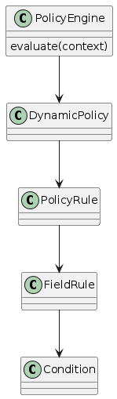
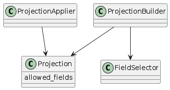
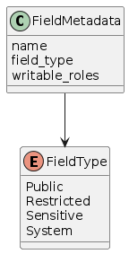
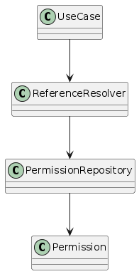
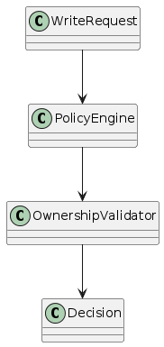
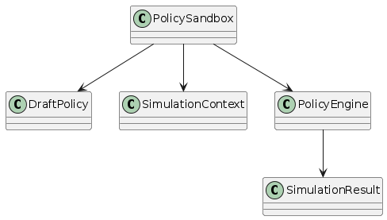
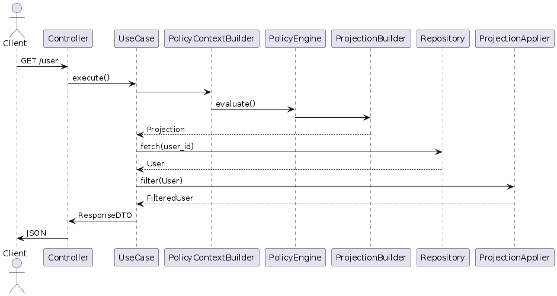

#+TITLE: Axum Clean — Dynamic Authorization & Projection Architecture
#+AUTHOR: System Architecture Specification
#+STARTUP: overview
#+OPTIONS: toc:3

* Overview

This document describes the architectural evolution of Axum Clean toward:

- Dynamic authorization
- Field-level policy enforcement
- Projection-based responses
- Runtime policy configurability
- Sandbox policy testing

Authorization is implemented strictly inside the *Application Layer*.

The system moves from static RBAC toward a dynamic policy-driven model.

---

* Core Architectural Idea

Traditional model:

Role → Allow/Deny Endpoint

New model:

Policy → Allowed Fields & Actions → Projection → Response

Authorization becomes a *data shaping mechanism*, not only an access gate.

---

* Layer Responsibilities

** Domain Layer

- Pure entities
- IDs only
- No authorization logic
- No policy loading

** Application Layer

- Policy Engine
- Projection Builder
- Authorization rules
- Reference resolution
- Ownership validation

** Interface Layer

- HTTP handling
- Serialization only

---

* Request → Response Lifecycle

1. HTTP request received
2. Use case execution begins
3. Policy context constructed
4. Policy evaluated
5. Projection generated
6. Repository queried
7. Projection applied
8. Response returned

---

* System Flow Diagram

#+begin_src plantuml :file 003-a/request_flow.png
@startuml

actor Client

rectangle "Interface Layer" {
Client --> Controller : HTTP Request
}

rectangle "Application Layer" {
Controller --> UseCase
UseCase --> PolicyContextBuilder
PolicyContextBuilder --> PolicyEngine
PolicyEngine --> ProjectionBuilder
UseCase --> Repository
Repository --> UseCase
UseCase --> ProjectionApplier
}

rectangle "Domain Layer" {
entity User
entity Report
}

UseCase --> Controller : Response DTO
Controller --> Client

@enduml
#+end_src

#+RESULTS:
[[file:003-a/request_flow.png]]

---

* Dynamic Policy Engine

Policies define permissions dynamically instead of compile-time rules.

Example concept:

IF role == Author
CAN read report.title
CAN write report.content
CANNOT approve own report

---

** Policy Structure Diagram

#+begin_src plantuml :file policy_engine.png
@startuml

class PolicyEngine {
evaluate(context)
}

class DynamicPolicy
class PolicyRule
class FieldRule
class Condition

PolicyEngine --> DynamicPolicy
DynamicPolicy --> PolicyRule
PolicyRule --> FieldRule
FieldRule --> Condition

@enduml
#+end_src

#+RESULTS:

---

* Projection System (GraphQL-like Behaviour)

Projection is generated automatically from policy evaluation.

Client does NOT choose fields directly.

Policy determines visible data.

---

** Projection Diagram

#+begin_src plantuml :file projection_system.png
@startuml

class Projection {
allowed_fields
}

class ProjectionBuilder
class FieldSelector
class ProjectionApplier

ProjectionBuilder --> Projection
ProjectionBuilder --> FieldSelector
ProjectionApplier --> Projection

@enduml
#+end_src

#+RESULTS:

---

* Field Security Model

Fields are classified by sensitivity.

** Field Types

| Type       | Example    | Controlled By |
| ---------- | ---------- | ------------- |
| Public     | first_name | Policy        |
| Restricted | email      | Policy        |
| Sensitive  | password   | Owner/System  |
| System     | version    | System only   |

---

** Field Metadata Diagram

#+begin_src plantuml :file field_security.png
@startuml

enum FieldType {
Public
Restricted
Sensitive
System
}

class FieldMetadata {
name
field_type
writable_roles
}

FieldMetadata --> FieldType

@enduml
#+end_src

#+RESULTS:

---

* Reference Resolution (AnythingId Solution)

Domain entities store only IDs:

PermissionId
RoleId
UserId

Application layer resolves full objects when required.

---

** Resolver Diagram

#+begin_src plantuml :file reference_resolution.png
@startuml

class UseCase
class ReferenceResolver
class PermissionRepository
class Permission

UseCase --> ReferenceResolver
ReferenceResolver --> PermissionRepository
PermissionRepository --> Permission

@enduml
#+end_src

#+RESULTS:

---

* Write Authorization & Ownership Rules

Example rule:

Author cannot approve own report.

Validation occurs during policy evaluation.

---

** Write Authorization Diagram

#+begin_src plantuml :file write_authorization.png
@startuml

class WriteRequest
class PolicyEngine
class OwnershipValidator

WriteRequest --> PolicyEngine
PolicyEngine --> OwnershipValidator
OwnershipValidator --> Decision

@enduml
#+end_src

#+RESULTS:

---

* Policy Sandbox (Future Feature)

Admins can test policies before activation.

Flow:

1. Create draft policy
2. Run simulation
3. Inspect permissions
4. Approve policy
5. Activate system-wide

---

** Sandbox Diagram

#+begin_src plantuml :file policy_sandbox.png
@startuml

class PolicySandbox
class DraftPolicy
class SimulationContext
class PolicyEngine

PolicySandbox --> DraftPolicy
PolicySandbox --> SimulationContext
PolicySandbox --> PolicyEngine
PolicyEngine --> SimulationResult

@enduml
#+end_src

#+RESULTS:

---

* Full Request Sequence

#+begin_src plantuml :file sequence_request.png
@startuml

actor Client

Client -> Controller : GET /user
Controller -> UseCase : execute()

UseCase -> PolicyContextBuilder
PolicyContextBuilder -> PolicyEngine : evaluate()

PolicyEngine -> ProjectionBuilder
ProjectionBuilder --> UseCase : Projection

UseCase -> Repository : fetch(user_id)
Repository --> UseCase : User

UseCase -> ProjectionApplier : filter(User)
ProjectionApplier --> UseCase : FilteredUser

UseCase -> Controller : ResponseDTO
Controller -> Client : JSON

@enduml
#+end_src

#+RESULTS:

---

* Final Mental Model

Policy
↓
Allowed Fields + Actions
↓
Projection
↓
Repository
↓
Response

Authorization becomes dynamic data shaping.

---

* Advantages

- Dynamic system behavior
- Field-level security
- No accidental data leakage
- Admin-configurable permissions
- GraphQL flexibility without GraphQL complexity
- Multi-tenant ready
- Audit-friendly

---

* Tradeoffs

- Increased application complexity
- Requires policy debugging tools
- Projection caching needed later

---

* Architectural Direction

This architecture combines ideas similar to:

- AWS IAM
- Google Zanzibar concepts
- GraphQL projections
- Clean Architecture

---

* Next Step

Design Policy DSL (Domain Specific Language):

The DSL defines how policies are written, validated, simulated, and activated.

This becomes the foundation of dynamic authorization.

#+END
